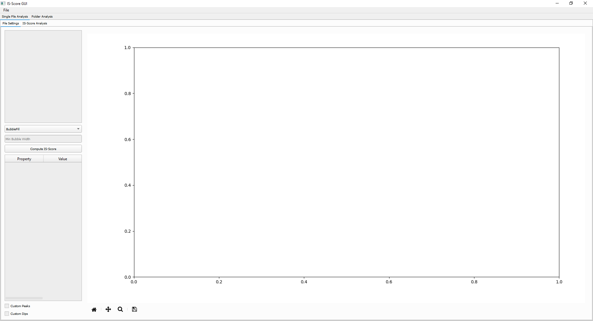

IS-Score-GUI
===============

Introduction
------------
The IS-Score module provides also a Graphic User Interface (GUI) to facilitate the evaluation of baseline quality in Raman spectroscopy data.
This GUI allows users to visualize their spectra, apply baseline corrections, and assess the quality of these corrections interactively.

**Important:** This GUI is still in development, and some features may not be fully functional or may change in future releases.

Usage
-----
Import the `runGUI` function from the `IS_Score_GUI` module to start the graphical user interface (GUI) for IS-Score

.. code-block:: python

    from IS_Score_GUI import runGUI

    if __name__ == "__main__":
        runGUI()

Features
--------
- **Loading File**: From the File menu, is possible to load a folder containing the Raman spectra files.
  The GUI supports various file formats, including CSV and TXT.

  .. image:: ./images/file_selected.png

- **Baseline Choice e IS-Score computation**: Once the file is loaded, the user can select the baseline correction method and compute the IS-Score from the left side combo box.
  The default algorithm is set to 'BubbleFill', but users can choose from other available methods. Once all the parameters are set, the user can click on the "Compute IS-Score" button to calculate the IS-Score for the selected spectrum.

  .. image:: ./images/baseline_selected.png

  On the left table is possible to see all the different penalization value applied to the spectrum, with the corresponding IS-Score value.

- **Check better the IS-Score computation**: The user can check better the analysis of the IS-Score by switching to the "IS-Score Analysis" tab.

  .. image:: ./images/is_score_analysis.png

  It provides a detailed view of the penalization with different plots, in light blue is visible the Raman spectrum and in orange the baseline under assessment.

  - **Intensity Penalization**: In red are visible all the Raman Shift which are penalized based on intensity value.

  - **Peaks and Dips Penalization**:

    - **Green 'X'**: Correspond to the peaks detected;
    - **Green 'o'**: Correspond to the evaluation point of the peaks;

    - **Blue 'X'**: Correspond to the dips detected;
    - **Blue '^'**: Correspond to the upper evaluation point of the dips;
    - **Blue 'v'**: Correspond to the lower evaluation points of the dips.

  - **AUC Penalization**: In red is visible the artificial baseline that mimic an overfitting baseline for the specturm.

  - **Peak Region Penalization**:
    - **Green 'X'**: Correspond to the peaks detected;
    - **Magenta Lines**: Correspond to the region for each peak;
    - **LightBlue lines**: Correspond to the Raman Shift prominences;
    - **Orange/Red Lines**: Correspond to the penalization applied to the peak region.

  - **Dip Region Penalization**
    - **Blue 'X'**: Correspond to the dips detected;
    - **Magenta Lines**: Correspond to the region for each dip;
    - **LightBlue lines**: Correspond to the Raman Shift prominences;
    - **Orange/Red Lines**: Correspond to the penalization applied to the peak region.

- **Custom Peaks and Dips Selection**: The user can select custom peaks and dips by checking the "Custom Peaks and Dips" checkbox.
  This allows for manual selection of peaks and dips, which can be useful for spectra with irregular features or when automatic detection is not sufficient.
  The two slide bars allow to set the tolerance for peaks and dips detection.

  By clicking on the right tables on a specific peak or dip, the user can select it and visualize it on the spectrum and if needed, remove it.

  .. image:: ./images/custom_peaks_dips.png

- **Run IS-Score over an entire folder**:By switching to the "Folder Analysis" tab, the user can select a specific folder and test different baselines correction methods on all the spectra contained in that folder.
  Is possible to select a specific folder and different baseline correction algorithms alongside with its parameters.
  By checking the "Allow Multiple Hyperparameters" is possible to add more values for the same parameters separated by a comma.

  By clicking the "Compute IS-Score on folder" button, the GUI will process all the spectra in the selected folder and compute the IS-Score for each one and show a boxplot at the end of the process.

  Additional, on the left-bottom corner is visible the table with all the outliers from the computation. By double click in a specific row, the user can visualize the spectrum with the baseline correction applied and the IS-Score computed in the previous tab.

  .. image:: ./images/is_score_on_folder.png

  By switching to the Folder IS-Score Analysis tab, the user can visualize the average spectra with each baseline tested.

  .. image:: ./images/folder_is_score_average.png
